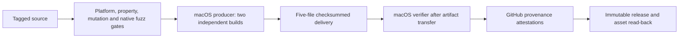

# Release pipeline and distribution contract

The v4 release contains a prebuilt native macOS application and the portable Python CLI artifacts. GitHub's macOS producer builds the universal Swift executable and applies an ad-hoc signature with `codesign --sign -`; no Developer ID certificate, signing secret, provisioning profile, or notarization service is used. Customers do not need Swift or Apple Command Line Tools to use the prebuilt app. CPython 3.14 remains an external runtime requirement.

## Source and qualification

A `vMAJOR.MINOR.PATCH` tag must match `pyproject.toml` and the changelog entry. The immutable publication controller checks the tag-push event, checked-out commit, remote tag target, release metadata, uploaded asset identities, and published read-back. Qualification runs on Linux, macOS, and Windows with standard and free-threaded CPython, followed by property exploration, the source-bound actionable mutation gate, and native receipt fuzzing with AddressSanitizer. Failed required jobs prevent publication.



## Exact release assets

| Artifact | Audience and contract |
| --- | --- |
| `remove-eml-attachments.pyz` | Portable CLI; requires CPython 3.14. |
| `eml_attachment_remover-VERSION-cp314-none-any.whl` | Python installation; metadata and wheel contents verified. |
| `eml_attachment_remover-VERSION.tar.gz` | Complete audited source, including editable artwork and native build tools. |
| `eml_attachment_remover-VERSION-macos-universal.zip` | Prebuilt macOS app, installation support, license, artwork provenance, and user instructions. |
| `SHA256SUMS` | Canonical checksum manifest covering the four artifacts above. |

No local runtime configuration, interpreter installation, private path, QA fixture, test result, development environment, cache, or unapproved extra asset belongs in the macOS archive. The app embeds the same exact zipapp bytes as the separately published CLI artifact.

## Producer

The macOS job installs the checksum- and signer-pinned official Swift.org compiler declared in `toolchain.toml`, uses the platform SDK and signing tools from Apple Command Line Tools or Xcode, and builds and qualifies the portable artifacts, builds the native app from an immutable source snapshot, normalizes app directory/document/executable permissions to 0755/0644/0755 before signing, and verifies the complete signature. It packages a sorted ZIP with fixed entry timestamps and explicit Unix permissions. Two independent native builds must produce the same archive bytes under the same runner toolchain; this does not promise identical output across different SDK/compiler versions. The entire candidate set is built and qualified outside the checkout. Only after verification does the producer reserve a same-parent publication directory, verify the copied bytes, and atomically publish it to the requested output; build staging cannot interfere with the source audit.

## Downloaded-artifact verification and publication

The publisher also runs on macOS. It verifies the exact artifact set and every checksum, checks the portable wheel/source/zipapp contracts, validates the ZIP member allowlist, metadata, size limits and safe paths, extracts into private temporary storage, checks the app version and minimum OS declaration, verifies both native architectures and the ad-hoc signature, and compares the bundled processor with the standalone zipapp. It verifies that archive documentation and installer support match the tagged source. GitHub artifact transfer carries the ZIP, never a loose app directory whose permissions might be lost.

Only this verified set is attested and passed to the existing changelog-bound immutable publisher. GitHub provenance attestations establish build provenance; they are not Developer ID identity, notarization, a malware scan, or Gatekeeper approval.

## Customer installation and updates

Customers download and extract the macOS ZIP, install CPython 3.14, and run the bundled installation instructions to install into their user Applications directory and record their chosen interpreter privately. Direct drag/copy installation also works with runtime discovery. Native app use does not require Shortcuts; the Finder Quick Action is an optional launch-only integration. Install the CLI from its wheel or invoke the standalone zipapp for automation that needs processing completion and exit status.

Ad-hoc signatures preserve executable/bundle integrity but are not trusted developer identities. A quarantined download may be blocked by Gatekeeper. Users who trust the official download can use the app-specific Privacy & Security → Open Anyway path documented by Apple; managed-machine policy may prohibit it. No installer removes quarantine, disables Gatekeeper, or automatically approves the app. Updates may require renewed approval. A damaged/modified signature is a failure to investigate, not a reason to weaken security checks.

## Independent design review

The reviewed design has one source commit, one final artifact manifest, and one publication controller. It avoids cross-runner asset mixing and avoids embedding the CI interpreter path. It preserves the Python processor and cross-platform CLI, explicitly retains external Python rather than silently adding runtime redistribution, checks signatures after packaging/transfer, bounds extraction, and separates expected Gatekeeper rejection from corruption. Native OS/hardware and real downloaded-app UI qualification remain distinct from structural archive checks and CI compilation.

## Maintainer audit procedure

Install the pinned compiler with `uv run /bin/sh integrations/macos-ui/install-swift-toolchain.sh`, run the complete release producer on macOS, reverify the resulting directory through the same verifier used by publishing, inspect the extracted application and install/update path, and compare each packaged artifact with `SHA256SUMS`. Retain runner/toolchain information and gate evidence. For release review, trace each workflow command to its local equivalent, inspect the tag/commit and changelog body, and verify GitHub asset read-back. Never substitute a manually rebuilt local app for the archive produced by the tagged release job.

The local `tools/tasks.py ci` plan runs complete delivery production and verification on macOS. On Linux and Windows those two steps explicitly use `--portable-only`; this checks CLI delivery and does not qualify a native release. The publication controller always requires all five files and macOS verification.

```sh
uv run python -B -m tools.release_delivery --output-directory release-dist
uv run --no-project --python 3.14.7 python -B -m tools.release_delivery --verify-directory release-dist
```

The installer stages the selected runtime configuration before changing the app and restores the previous bundle if runtime publication fails. It retains the prior bundle on successful updates. It installs only the app and its runtime selection; CLI installation is independent.

## Application identity and ownership metadata

The permanent bundle identifier is `io.github.resoltico.emlattachmentremover`, based on the repository namespace. Displayed copyright is derived from the copyright notice in the bundled project `LICENSE`. Release verification checks both fields. App updates require the permanent identity and retain a recoverable prior bundle and runtime configuration.

The separate macOS delivery compatibility workflow builds one current-runner candidate, transfers that exact archive to macOS 14 Intel and macOS 15 Intel, verifies it, and launches its packaged executable through a synthetic processing receipt. GitHub retires macOS 14 hosted runners on November 2, 2026; after that date minimum-OS execution requires a maintained macOS 14 runner rather than silently changing the supported floor.
