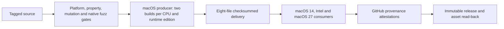

# Release pipeline and distribution contract

The v4 release contains separate Apple Silicon and Intel macOS applications and the portable Python CLI artifacts. GitHub's macOS producer builds each single-architecture Swift executable and applies an ad-hoc signature with `codesign --sign -`; no Developer ID certificate, signing secret, provisioning profile, or notarization service is used. Customers do not need build tools to use a prebuilt app. The primary apps include a private, integrity-pinned CPython runtime; smaller external-Python editions require a separately managed CPython 3.14.

## Source and qualification

Candidate notes may use an undated version heading while the release date is undecided; `uv run python -m tools.publish_release --check` validates and extracts those notes without publication. Actual publication requires a valid ISO date in the selected release heading, and historical entries remain dated.

A `vMAJOR.MINOR.PATCH` tag must match `pyproject.toml` and the changelog entry. The immutable publication controller checks the tag-push event, checked-out commit, remote tag target, release metadata, uploaded asset identities, and published read-back. Qualification runs on Linux, macOS, and Windows with standard and free-threaded CPython, followed by property exploration, the source-bound actionable mutation gate, and native receipt fuzzing with AddressSanitizer. Failed required jobs prevent publication.



## Exact release assets

| Artifact | Audience and contract |
| --- | --- |
| `remove-eml-attachments.pyz` | Portable CLI; requires CPython 3.14. |
| `eml_attachment_remover-VERSION-cp314-none-any.whl` | Python installation; metadata and wheel contents verified. |
| `eml_attachment_remover-VERSION.tar.gz` | Complete audited source, including editable artwork and native build tools. |
| `eml_attachment_remover-VERSION-macos-arm64.zip` | Self-contained Apple Silicon app with CPython, runtime notices, a root-level optional installer, project license and customer instructions. |
| `eml_attachment_remover-VERSION-macos-x86_64.zip` | Self-contained Intel app with the same supporting files. |
| `eml_attachment_remover-VERSION-macos-arm64-external-python.zip` | Smaller Apple Silicon app requiring a separately managed CPython 3.14. |
| `eml_attachment_remover-VERSION-macos-x86_64-external-python.zip` | Smaller Intel app requiring a separately managed CPython 3.14. |
| `SHA256SUMS` | Canonical checksum manifest covering the seven artifacts above. |

No local runtime configuration, machine-specific interpreter installation, private path, QA fixture, test result, development environment, cache or unapproved extra asset belongs in the macOS archive. Bundled editions include only the runtime tree derived from the pinned upstream archive, retaining its licensing notices. The app embeds the same exact zipapp bytes as the separately published CLI artifact. The producer validates and executes that zipapp against its source before packaging; downloaded-artifact verification checks its manifest digest and equality with the signed app’s bundled processor. It does not rerun the zipapp’s full source-member comparison.

ZIP remains the sole macOS container for this release. The primary app supports ordinary Finder copy installation; external-Python users follow the included interpreter-selection instructions. A DMG could provide an Applications drag target but adds mounting and another verification surface without changing runtime requirements or Gatekeeper approval. [Apple’s distribution guidance](https://developer.apple.com/documentation/xcode/packaging-mac-software-for-distribution) supports both ZIP and DMG containers. Keep one tested container rather than publishing redundant formats.

## Producer

The `toolchain.toml` delivery section declares the hosted macOS image, Xcode version and Xcode build. Producer and publisher jobs use that image label and `ci-sdk.sh` verifies/selects that exact Xcode installation before delivery operations. A versioned image label still receives OS/package updates, so this is not an immutable full-machine snapshot. Local developer builds can use a supported newer SDK; they do not establish byte identity with the pinned hosted SDK.

The macOS job installs the checksum- and signer-pinned official Swift.org compiler declared in `toolchain.toml`, uses a full Xcode 26-or-later installation for the SDK, Icon Composer `actool`, and signing tools, and builds and qualifies the portable artifacts. It compiles the editable icon once per candidate set into `Assets.car` and `EML.icns`; Xcode's compiled asset catalog contains variable timestamps and rendition identifiers, so byte comparison across separate icon compilations is not a valid reproducibility gate. Each architecture/runtime edition is then built twice from the same source and the same compiled icon, directory/ordinary-file/executable permissions are normalized to 0755/0644/0755 before signing, and complete signatures are verified. All deliverables use the actual build invocation datetime, shared through `SOURCE_DATE_EPOCH`, rather than a fixed historical date. ZIP timestamps use the builder’s local wall time with two-second precision and include the absolute UTC timestamp fields, including the Info-ZIP Unix field honored by macOS `ditto`. Source tarballs, wheels, zipapps and native ZIPs include explicit directory entries so compatible extractors restore directory timestamps too. A separate build invocation receives a fresh datetime and can therefore have different checksums. Each pair of sorted ZIPs within one invocation must match byte-for-byte under the same runner toolchain; this does not promise identical output across different SDK/compiler versions or independent icon compilations. The entire candidate set is built and qualified outside the checkout. Only after verification does the producer reserve a same-parent publication directory, verify the copied bytes, and atomically publish it.

The bundled runtime source is declared by architecture in `runtime-source.toml`, including URL, SHA-256, archive size and target. Its version must match `.python-version`; original component notices accompany the install tree. `EML_RUNTIME_SOURCE_DIRECTORY` can supply the exact upstream filenames for both building and verification. Every use rechecks the pinned size and digest before extraction, so a supplied cache does not establish trust or reuse build products. Runtime signing and app staging start fresh for every independent build. The pruned standard library is precompiled before signing using an isolated pinned CPython compiler process, unchecked-hash bytecode, optimization level zero and stable relative source filenames. Reference verification independently regenerates and compares the same bytecode. Processing and installation disable additional bytecode writes; `-B` still permits reading the delivered caches.

## Downloaded-artifact verification and publication

Before publication, GitHub transfers the build job's exact eight-file set to macOS 14 Apple Silicon, macOS 15 Intel and macOS 27 Apple Silicon consumers. Each consumer reverifies the full set, runs the downloaded app on its OS and CPU, and runs the host-native test gate; macOS 14 also exercises the Intel ZIP through Rosetta. Failure on any required consumer blocks publication. The publisher then reverifies the same transferred set and every checksum, compares source and wheel contents with the tagged checkout, validates each ZIP member allowlist, metadata, size limits and safe paths, extracts into private temporary storage, checks the app version and minimum OS declaration, verifies each archive contains only its named CPU and an intact ad-hoc signature, and compares the bundled processor with the standalone zipapp. Bundled runtime trees must match the pinned upstream tree, including file modes and link targets; ordinary files are byte-compared and native code is compared by canonical re-signing and full code-directory hashes, with CPU and minimum-OS checks. It checks the compiled icon resources and that archive documentation and installer support match the tagged source. GitHub artifact transfer carries ZIPs, never loose app directories whose permissions might be lost.

Only this verified set is attested and passed to the existing changelog-bound immutable publisher. GitHub provenance attestations establish build provenance; they are not Developer ID identity, notarization, a malware scan, or Gatekeeper approval.

## Customer installation and updates

Customers select the Apple Silicon (`arm64`) or Intel (`x86_64`) ZIP for their Mac. The primary app can be copied into their user Applications directory. External-Python users install CPython 3.14 and follow the included installer instructions to record their chosen interpreter privately. The installer reads the signed executable’s 64-bit Mach-O header and refuses a CPU/subtype that does not match the Mac; this check does not invoke developer-tool shims. The bundled app uses its own interpreter after relocation; the external edition supports runtime discovery when no interpreter was selected. Native app use does not require Shortcuts; the Finder Quick Action is an optional launch-only integration. Install the CLI from its wheel or invoke the standalone zipapp for automation that needs processing completion and exit status.

Ad-hoc signatures preserve executable/bundle integrity but are not trusted developer identities. A quarantined download may be blocked by Gatekeeper. Users who trust the official download can use the app-specific Privacy & Security → Open Anyway path documented by Apple; managed-machine policy may prohibit it. No installer removes quarantine, disables Gatekeeper, or automatically approves the app. Updates may require renewed approval. A damaged/modified signature is a failure to investigate, not a reason to weaken security checks.

## Independent design review

The reviewed design has one source commit, one final artifact manifest, and one publication controller. It avoids cross-runner asset mixing and avoids embedding the CI interpreter path. It preserves the Python processor and cross-platform CLI, makes runtime redistribution explicit in the primary edition and retains a distinct external-Python edition, checks signatures after packaging/transfer, bounds extraction, and separates expected Gatekeeper rejection from corruption. Native OS/hardware and real downloaded-app UI qualification remain distinct from structural archive checks and CI compilation.

## Maintainer audit procedure

Install the pinned compiler with `uv run /bin/sh integrations/macos-ui/install-swift-toolchain.sh`, run the complete release producer on macOS, reverify the resulting directory through the same verifier used by publishing, inspect the extracted application and install/update path, and compare each packaged artifact with `SHA256SUMS`. Retain runner/toolchain information and gate evidence. For release review, trace each workflow command to its local equivalent, inspect the tag/commit and changelog body, and verify GitHub asset read-back. Never substitute a manually rebuilt local app for the archive produced by the tagged release job.

The local `tools/tasks.py ci` plan runs complete delivery production and verification on macOS. On Linux and Windows those two steps explicitly use `--portable-only`; this checks CLI delivery and does not qualify a native release. The publication controller always requires all eight files and macOS verification.

```sh
uv run python -B -m tools.release_delivery --output-directory release-dist
uv run --no-project --python 3.14.8 python -B -m tools.release_delivery --verify-directory release-dist
```

For external-Python apps, the installer stages the selected runtime configuration before changing the app and restores the previous bundle if runtime publication fails. Bundled installs leave that configuration unchanged and preserve safe runtime-relative links. It retains the prior bundle on successful updates. It installs only the app and its runtime selection; CLI installation is independent.

## Application identity and ownership metadata

The signed bundle includes `Contents/Resources/.eml-ui-installation`, a constant product marker written by the builder and checked by the installer and release verifier. It contains no machine path, interpreter selection, QA state or installation history. It identifies a bundle eligible for this installer; it does not prove publisher identity or mean the app has already been installed. Removing it modifies the signed bundle and makes installation fail. External-runtime selection is stored separately in the user’s private application-support directory.

The permanent bundle identifier is `io.github.resoltico.emlattachmentremover`, based on the repository namespace. Displayed copyright is derived from the copyright notice in the bundled project `LICENSE`. Release verification checks both fields. App updates require the permanent identity and retain a recoverable prior bundle and runtime configuration.

`pyproject.toml` is authoritative for both versions: `project.version` supplies `CFBundleShortVersionString`, and `tool.eml-attachment-remover.macos.build-number` supplies `CFBundleVersion`. The latter is a committed positive integer from 1 to 9999, increased before distributing a changed native build and never reset when the release version changes. It starts at 5, above the earlier unpublished bundle value `4.0.0` in macOS version ordering. Local builds, both CPU variants, CI reruns and source-archive rebuilds read the same number; compilation never increments it. The native About panel displays the release and build directly from bundle metadata. A build number identifies a distributed native app revision, not byte-for-byte artifact identity: checksums identify exact delivered bytes, and SDK/compiler or icon-rendering differences can affect rebuilt artifacts. Private working-tree experiments can reuse a number, but must receive an increased committed number before distribution.

The separate pull-request macOS delivery compatibility workflow builds one current-runner candidate set, transfers all four exact archives to macOS 14 Apple Silicon, macOS 15 Intel and macOS 27 Apple Silicon, verifies them, and launches the matching packaged executable through a synthetic processing receipt. The tagged release workflow independently repeats the consumer checks on its own exact artifacts before publication. The macOS 14 lane also tests the Intel archive under Rosetta. GitHub retires macOS 14 hosted runners on November 2, 2026; after that date minimum-OS execution requires a maintained macOS 14 runner rather than silently changing the supported floor.

GitHub release and compatibility producers use UTC and capture a fresh datetime when `release_delivery` starts. Both architectures, portable artifacts, and independent comparison builds inherit that same datetime; reruns capture a new one. Consumer and publication jobs validate the timestamps encoded in the downloaded archives, not their current clocks. Uploading the finished archives preserves their internal timestamp metadata because it is part of their checksummed bytes. The Actions transport container and newly downloaded outer files/directories may receive transport or download times; their filesystem times are not build provenance, and verifiers do not treat them as such. Browser downloads similarly control the outer archive’s filesystem timestamp. All delivery archives retain the build datetime for their archived files and directories on supported extractors. Extractors may create an additional outer wrapper directory with their own extraction time.

## Licensing and corresponding source

Project software and documentation use MPL 2.0; project artwork uses the separate proprietary grant in LICENSE. Preserve both grants and redistribute artwork unchanged with this application. Each published binary release must include its matching source archive; release delivery already verifies that archive against the complete public source surface, including native Swift sources, editable artwork and build configuration. Keep the source archive beside private candidate distributions too. The project LICENSE includes the source-availability notice and is copied into the wheel, zipapp and native archives. Preserve separately licensed CPython and dependency notices in bundled editions. Earlier published MIT versions retain their original grants; do not rewrite their tags, artifacts or historical licensing attribution.

Bundled-runtime notice verification is independent of the archive digest: every license pathname declared in upstream `PYTHON.json` must be an ordinary nonempty notice in the delivered runtime. The runtime notice supplements restore the two texts missing from the pinned macOS archive; their original licensing and provenance are documented in [runtime-notices](runtime-notices/README.md). The project LICENSE records relocation, permission normalization, ad-hoc re-signing, omission of static build archives and notice supplementation as the runtime packaging changes.

The private runtime is dedicated to the processor, not a general-purpose Python installation. Packaging removes the stdlib test suite and native test extensions, IDLE, turtle/Tk modules and Tcl/Tk libraries, ensurepip/site-packages, package-manager and documentation launcher scripts, headers and build configuration files. Processing imports and SSL/SQLite functionality are exercised against the real bundled interpreter; notices and original upstream provenance metadata remain. Archive equality alone does not prove that pruning is correct.

## Customer archive contents

Each macOS ZIP contains the app, `INSTALL.txt`, `LICENSE`, and an optional root-level `install.sh`. Runtime launch support stays inside the app. Developer QA, build/release documentation, artwork provenance and editable artwork stay in the complete source archive. The wheel and zipapp contain processor code, metadata and required license/schema data; CI test, mutation, property and fuzz evidence is retained as workflow artifacts and is not attached as a customer release asset.

The private runtime excludes development configuration files and manual pages. For pinned runtimes explicitly built with a statically linked interpreter, it also excludes the separately supplied embedding `libpython` library; unknown or dynamically linked runtime configurations retain that library. Runtime licenses and original build metadata remain intact.

CI caches only the pinned upstream source archives using `.github/actions/runtime-source`. Cache hits are size- and SHA-256-checked before use; cold caches download both architectures once per job. Extraction, pruning, bytecode compilation and signing remain fresh for each independent build. Runtime upgrades remain reviewed changes to the pinned archive, including assessment of its component versions and applicable upstream security advisories; a library being unused by normal processing is not a guarantee of zero exposure.
